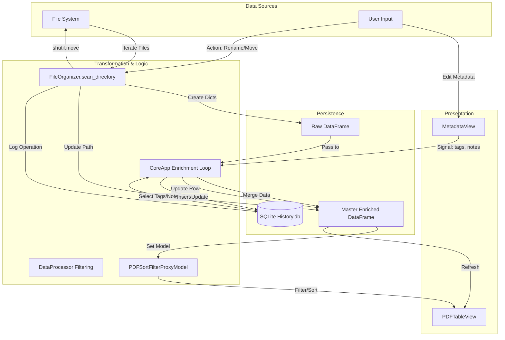

# Data Flow Diagram

This diagram illustrates how data propagates through the system, from the initial file system scan to the user interface, and how updates flow back to the persistence layer.

## Data States

1.  **Raw State**: `[{'original_path': 'C:/...', 'filename': 'doc.pdf'}]`
    *   Generated by `FileOrganizer`.
2.  **Enriched State**: Raw + `{'tags': 'invoice', 'notes': 'paid'}`
    *   Merged in `CoreApp` using data from `SQLite`.
3.  **View State**: Enriched State filtered by `Regex` search.
    *   Managed by `QSortFilterProxyModel`.
