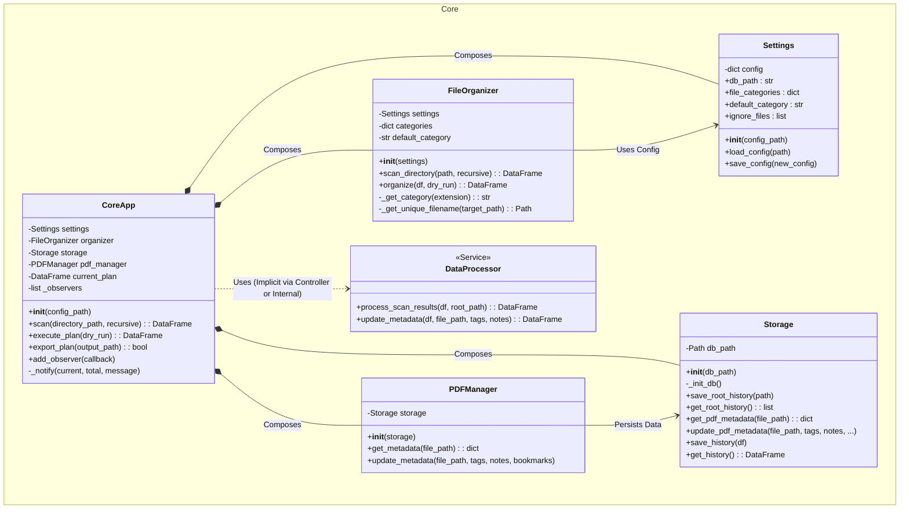
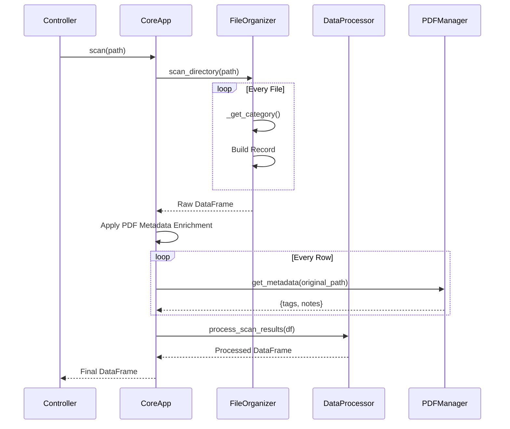

# Core Domain Diagram

This diagram details the internal structure and relationships of the `src.core` package, which encapsulates the application's business logic.

## Interaction Flow (Scan & Organize)

