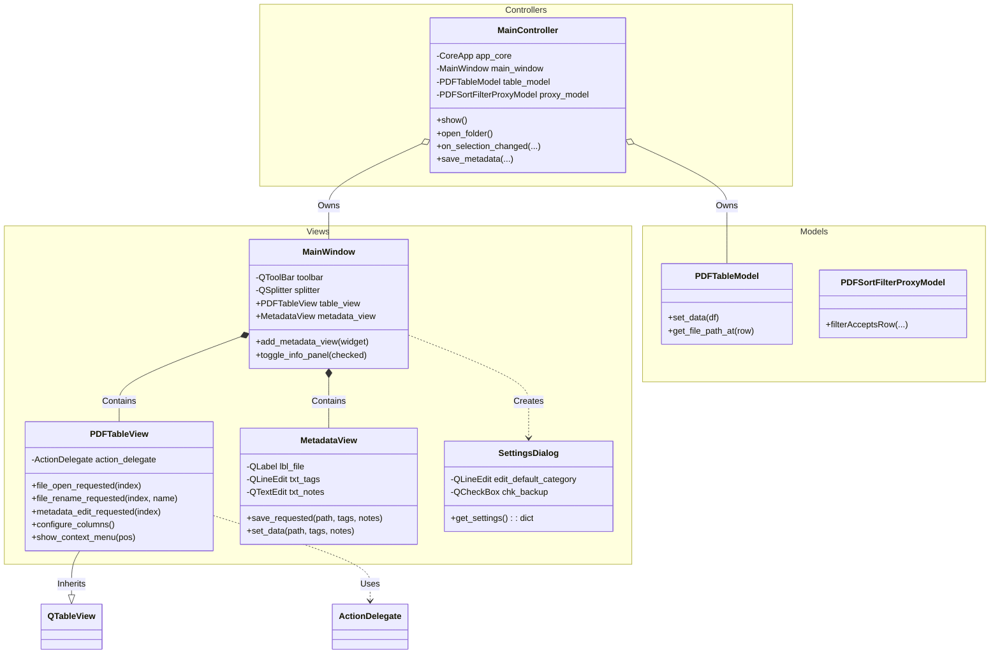
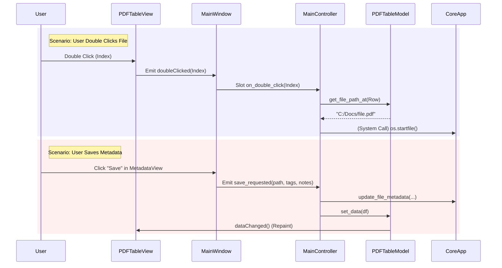

# UI Subsystems Diagram

This diagram details the `src.apps.pdf_ms` package, focusing on the View-Controller interactions and the signal/slot architecture.

## Class Hierarchy (View Layer)

## Signal Flow (User Interaction)

