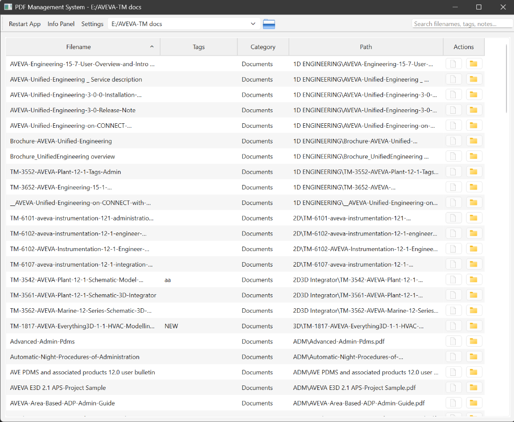

# User Guide (Phase 1: MVP Polish)

**Version:** 0.1.1
**Date:** 2026-01-01

## 1. Introduction
The **Local PDF Explorer / File Organizer** is a desktop application designed to help you manage, categorize, and tag your local document libraries without needing a cloud subscription.

## 2. Getting Started

### 2.1 Launching the Application
Double-click the `run.bat` file in the root folder. The application window will appear.

### 2.2 Connecting to a Folder
1.  Click the **Open Folder** icon (Folder icon) in the top toolbar.
2.  Select the directory containing your PDFs.
3.  The application will scan the folder recursively and list all files.

## 3. Features

### 3.1 Viewing Files
The main table displays:
*   **Filename**: The name of the file.
*   **Tags**: Your custom tags.
*   **Category**: Auto-detected type (e.g., Documents).
*   **Path**: The folder location.

### 3.2 Searching
Type in the **Search Bar** (top right) to filter files instantly.
*   *Example*: Type `invoice` to see only filenames containing "invoice".

### 3.3 Editing Metadata
1.  Select a file in the list.
2.  The **Metadata Panel** (on the right) will load.
3.  Enter **Tags** (comma separated) and **Notes**.
4.  Click **Save** or press `Ctrl+S`.
    *   *Note*: This data is saved to a local database and persists even if you move the file (using the Rename feature).

### 3.4 Renaming Files
Right-click a file and select **Rename**. The application will:
1.  Rename the physical file on disk.
2.  Update the database record.
3.  Refresh the list automatically.

## 4. Troubleshooting
*   **App not opening**: Ensure you have Python installed. Try running `scripts/run_phase1.bat` to check for errors.
*   **Search not finding notes**: Currently, search only applies to Filenames. (Coming in Phase 2).
