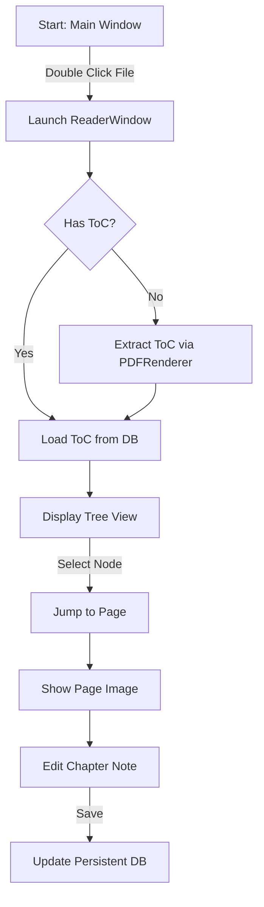

# Phase 2: ToC & Reader - Use Cases & Workflow

## 1. Overview
The **Integrated Reader** transforms the application from a simple file organizer into a content review platform. It leverages the extracted Table of Contents (ToC) to provide structure-aware navigation and annotation.

## 2. Use Cases

### UC-1: Rapid Navigation
*   **Actor**: Engineer / Researcher.
*   **Scenario**: User needs to find "Installation Specs" in a 500-page manual.
*   **Action**: Opens file -> Expands "Installation" node in ToC -> Clicks "Specs".
*   **Result**: Reader jumps immediately to the exact page (e.g., Page 42).

### UC-2: Contextual Annotation (Study Notes)
*   **Actor**: Student / Analyst.
*   **Scenario**: User is reviewing a specific chapter and wants to note down key findings *linked* to that chapter.
*   **Action**: Selects "Chapter 3" in ToC -> Types "Important: This requires Protocol v2" in the Notes panel.
*   **Result**: The note is saved and attached to the "Chapter 3" node, not just the file in general.

### UC-3: Structural Overview
*   **Actor**: Manager.
*   **Scenario**: Wants to check if a generated report has all required sections (Intro, Methods, Conclusion).
*   **Action**: Opens file -> Glances at ToC tree.
*   **Result**: Validates document structure without scrolling through pages.

## 3. Workflow Diagram

## 4. Technical Workflow (Headless/Scalable)

1.  **Extraction**: `PDFRenderer.get_toc(path)` extracts the raw hierarchy using `pymupdf`.
2.  **Rendering**: `PDFRenderer.render_page(path, page)` generates a PNG blob (stateless).
3.  **Persistence**: The enriched ToC (with User Notes) is serialised to JSON and stored in the `bookmarks` column of the `pdf_metadata` table.
